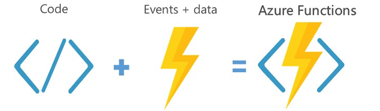

# Challenge 1 - Create and deploy your first Azure Function

Best For You Organics Company (BFYOC) is ready to begin their serverless journey and has decided to start with Azure Functions. Their first step will be to setup their developers with the tools and configuration necessary to create and test their code locally.



In this challenge you will create your first serverless
function and deploy it to Azure.

## Prerequisites

* A modern laptop running Windows 10, Mac OSX, Mac OS X 10.12 or higher
* Your preferred IDE (integrated development environment). Recommendations:
  * [Visual Studio Code](https://code.visualstudio.com/)
  * [Visual Studio](https://visualstudio.microsoft.com/)
  * [Eclipse](https://www.eclipse.org/downloads/packages/)
  * [IntelliJ IDEA](https://www.jetbrains.com/idea/download)
* .NET - [.NET Core 2.1 SDK or higher](https://dotnet.microsoft.com/download)
* JavaScript - [NodeJS](https://nodejs.org/en/) (8.11.1 or 10.14.11 recommended)
* [Azure Functions Core Tools](https://github.com/Azure/azure-functions-core-tools#installing)

## Challenge

### Create a local function

Your first goal is to create and debug an HTTP
triggered Azure Function locally on your own development machine. This
function has the following requirements:

* **Verb**: GET
* **Input parameters**: A `productId` value is passed to it as a
query parameter or an HTTP route
* **Response**: "The product name for your product id
{`productId`} is Starfruit Explosion"
* **Sample request**:

    ``` 
    GET http://localhost:7071/api/<your-function-name>?productId=2424
    ```

### Deploy to Azure

The second goal is to create a Resource Group in your Azure Subscription, and deploy the function to Azure. To complete this goal, the following requirements must be satisfied:

* **Create a Function App**: Create a new Function App that is hosted on the Consumption Plan.
* **Deploy and Test**: Deploy your new function to the Function App.

**Make sure to use different, unique Function App names!**

## Success Criteria

The following goals must be met to successfully complete this challenge:

* Demonstrate that you created an HTTP triggered Azure Function locally that accepts a GET verb. Show that you can call that function and receive a successful response with the right text provided and the value of `productId` properly filled in.

* Show that you deployed that HTTP triggered
Azure Function to Azure. Call that deployed
function and receive a successful response.

## References

* [An introduction to Azure Functions](https://docs.microsoft.com/en-us/azure/azure-functions/functions-overview)
* Review the [Supported Languages in Azure Functions](https://docs.microsoft.com/en-us/azure/azure-functions/supported-languages)
  guide and go into the specific guide for the language you are using
* [Strategies for testing your code in Azure Functions](https://docs.microsoft.com/en-us/azure/azure-functions/functions-test-a-function)
* [Code and test Azure Functions locally](https://docs.microsoft.com/en-us/azure/azure-functions/functions-develop-local)
* [Azure Functions HTTP and webhook bindings](https://docs.microsoft.com/en-us/azure/azure-functions/functions-bindings-http-webhook)
* [Azure Functions with Visual Studio Code](https://docs.microsoft.com/en-us/azure/azure-functions/functions-develop-vs-code)
* [Azure Functions with Visual Studio](https://docs.microsoft.com/en-us/azure/azure-functions/functions-create-your-first-function-visual-studio)
* [Create your first Azure function with Java and IntelliJ](https://docs.microsoft.com/en-us/azure/azure-functions/functions-create-maven-intellij)
* [Create your first Azure function with Java and Eclipse](https://docs.microsoft.com/en-us/azure/azure-functions/functions-create-maven-eclipse)
* [Quickstart: Use Java to create and publish a function to Azure Functions](https://docs.microsoft.com/en-us/azure/azure-functions/functions-create-first-java-maven)
* [Python: Create an HTTP triggered function in Azure](https://docs.microsoft.com/en-us/azure/azure-functions/functions-create-first-function-python)
* [Create your first PowerShell function in Azure](https://docs.microsoft.com/en-us/azure/azure-functions/functions-create-first-function-powershell)

## Next Challenge

Once you have your function working and deployed, proceed to the next challenge and begin - [Cosmos DB and Azure Functions](..//Challenge-2-Cosmos-DB-and-Azure-Functions/readme.md).
