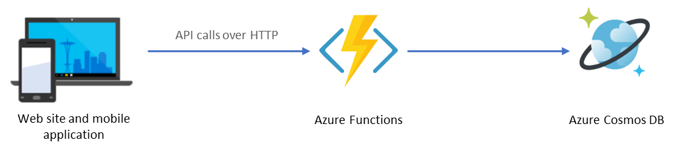

# Challenge 2 - Cosmos DB and Azure Functions

Best For You Organics Company (BFYOC) has begun the creation of a mobile application and website, both of which will be used to update products and submit feedback for their ice cream. The website and application will be calling a set of APIs.

BFYOC would like you to create the APIs that enable business users to add and retrieve information about their products.



The diagram above shows how Azure Functions will be leveraged to provide the APIs for the clients. Cosmos DB will be the database to persist all the product and relevant information.

## Challenge

### Create a Cosmos DB instance on Azure

Provision and configure an instance of Cosmos DB as the database for the BFYOC products. 
* Review the [binding options](https://docs.microsoft.com/en-us/azure/azure-functions/functions-bindings-cosmosdb-v2) for Cosmos DB and Azure Functions.
* Leverage the SQL API if you wish to use the Azure Functions bindings suppport.

### Create the APIs

Your challenge is to create and deploy the following three functions:

* **CreateProduct**
  * **Verb**: POST
  * **Input payload example**:

    ``` JSON
    {
       "productId": "75542e38-563f-436f-adeb-f426f1dabb5c",
       "productName": "Starfruit Explosion",
       "productDescription": "This starfruit ice cream is out of this world!"
    }
    ```

  * **Requirements**
    * Add a property called `id` with a GUID value
    * Add a property called `timestamp` with the current UTC date time    
    * Add the product to the Cosmos DB data store
    * Return the entire JSON payload with the newly created `id` and
     `timestamp`, for example:

      ``` JSON
      {
        "id": "79c2779e-dd2e-43e8-803d-ecbebed8972c",      
        "productId": "75542e38-563f-436f-adeb-f426f1dabb5c",
        "productName": "Starfruit Explosion",
        "productDescription": "This starfruit ice cream is out of this world!",        
        "timestamp": "2019-09-14 21:27:47Z"        
      }
      ```

* **GetProduct**
  * **Verb**: GET
  * **QueryString or route parameter**: `productId`
  * **Requirements**
    * Get the product from your database and return the entire JSON payload for
     the product identified by the id, for example:

      ``` JSON
      {
        "id": "79c2779e-dd2e-43e8-803d-ecbebed8972c",      
        "productId": "75542e38-563f-436f-adeb-f426f1dabb5c",
        "productName": "Starfruit Explosion",
        "productDescription": "This starfruit ice cream is out of this world!",        
        "timestamp": "2019-09-14 21:27:47Z"        
      }
      ```

* **GetProducts**
  * **Verb**: GET
  * **Requirements**
    * Get all the products from the database and return the entire
      JSON payload for each one, for example:

      ``` JSON

      [
        {
            "id": "79c2779e-dd2e-43e8-803d-ecbebed8972c",      
            "productId": "75542e38-563f-436f-adeb-f426f1dabb5c",
            "productName": "Starfruit Explosion",
            "productDescription": "This starfruit ice cream is out of this world!",        
            "timestamp": "2019-09-14 21:27:47Z"        
        },
        {
            "id": "76065ecd-8a14-426d-a4cd-abbde2acbb10",      
            "productId": "e94d85bc-7bd0-44f3-854e-d8cd70348b63",
            "productName": "Tropical Mango",
            "productDescription": "You know what they say... It takes two.  You.  And this ice cream.",        
            "timestamp": "2019-09-14 21:27:47Z"        
        }
      ]

      ```

## Success Criteria

* Test all three functions and deploy them to Azure.
* The endpoints should return standard HTTP status codes. For example, 404 when items are not found.

## References

* [Azure Functions triggers and bindings concepts](https://docs.microsoft.com/en-us/azure/azure-functions/functions-triggers-bindings)
* [Introduction to Cosmos DB](https://docs.microsoft.com/en-us/azure/cosmos-db/introduction)
* [Azure Cosmos DB bindings for Azure Functions](https://docs.microsoft.com/en-us/azure/azure-functions/functions-bindings-cosmosdb-v2)
* [Azure Functions HTTP and webhook bindings](https://docs.microsoft.com/en-us/azure/azure-functions/functions-bindings-http-webhook)
* [Store unstructured data using Azure Functions and Azure Cosmos DB](https://docs.microsoft.com/en-us/azure/azure-functions/functions-integrate-store-unstructured-data-cosmosdb)

## Next Challenge

Once you have your function working and deployed, proceed to the next challenge and begin - [Logic Apps](..//Challenge-3-Logic-Apps/readme.md).