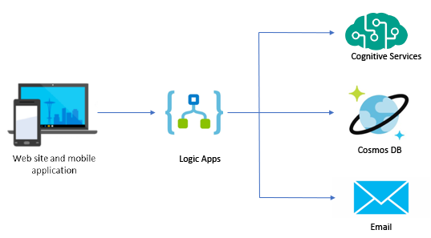

# Challenge 3 - Logic Apps

At Best For You Organics Company (BFYOC), customer satisfaction is of the utmost importance. To provide customers with the best products, BFYOC would like to provide a customer survey to collect feedback.

BFYOC would like you to use [Logic Apps](https://azure.microsoft.com/en-us/services/logic-apps/) as the workflow engine and integration platform to connect all the necessary pieces for this new feature.



The image above highlights the Azure services that will be leveraged to complete this challenge.

## Challenge

### Create a HTTP triggered Logic App

Create a new Logic App that is triggered by a HTTP request. Use the sample payload provided below to generate a schema for the incoming request.

* **Verb**: POST

* **Input payload example**:

    ``` JSON
    {
        "userId": "cc20a6fb-a91f-4192-874d-132493685376",
        "productId": "4c25613a-a3c2-4ef3-8e02-9c335eb23204",
        "userFeedback": "This is my favorite one!"
    }
    ```

### Detect the Sentiment of the User Feedback

 Detect the sentiment of the `userFeedback` field to receive a numeric score between 0 and 1. Scores close to 1 indicate a positive sentiment, while scores close to 0 are indicative of a negative sentiment.

* **Cognitive Services**: Provision an instance of Cognitive Services to support text analysis.

* **Detect Sentiment**: Retrieve the numeric score for the `userFeedback` field by leveraging one of the Cognitive Services actions for text analysis.

### Store the Feedback and Score in Cosmos DB

Add the user feedback, along with the sentiment score, to a new collection in the Cosmos DB database that was created in the previous challenge.

* **Partition key**: Use the `productId` as the partition key.
* **Feedback example**:

    ``` JSON
    {
        "id": "abc0a6fb-a93e-4192-874d-132493612126",
        "productId": "4c25613a-a3c2-4ef3-8e02-9c335eb23204",
        "userId": "cc20a6fb-a91f-4192-874d-132493685376",
        "userFeedback": "This is my favorite one!",
        "score": "0.982596516609192"
    }
    ```

### Email Notifications for Feedback

BFYOC would like to notify their customer service representatives immediately if there are any unfavorable comments.

* **Conditional logic**: When sentiment analysis score is below `.70`, send an email from the Logic App to an address that you can monitor.
* **Email**: Select an action from the list of email providers (examples: Office 365, SendGrid and Gmail)
* **Contents**: Include in the email body the sentiment score and user feedback.

## Success Criteria

* Invoke the Logic App with a HTTP request from a client such as [cURL](https://curl.haxx.se/) or [Postman](https://www.getpostman.com/).
* Test with both negative and positive feedback results.
* Confirm that emails are sent only for scores below `.70`.
* Review and inspect the run history of the Logic App to validate the results.

## References

* [Quickstart: Create your first automated workflow with Azure Logic Apps - Azure portal](https://docs.microsoft.com/en-us/azure/logic-apps/quickstart-create-first-logic-app-workflow)
* [Tutorial: Create automated approval-based workflows by using Azure Logic Apps](https://docs.microsoft.com/en-us/azure/logic-apps/tutorial-process-mailing-list-subscriptions-workflow)
* [Create conditional statements that control workflow actions in Azure Logic Apps](https://docs.microsoft.com/en-us/azure/logic-apps/logic-apps-control-flow-conditional-statement)
* [Sentiment detection](https://docs.microsoft.com/en-us/azure/azure-functions/functions-twitter-email#add-sentiment-detection)

## Next Challenge

Once you have your Logic App working, proceed to the next challenge and begin - [API Management](..//Challenge-4-API-Management/readme.md).
